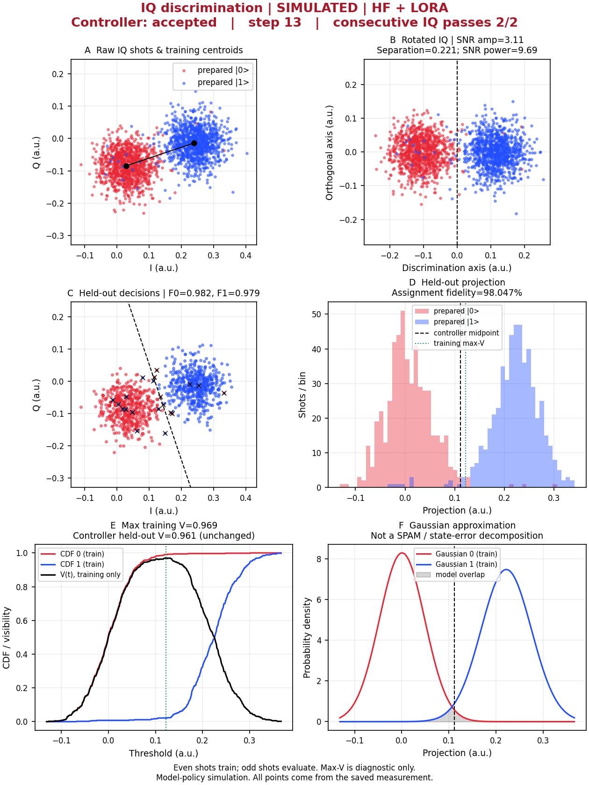
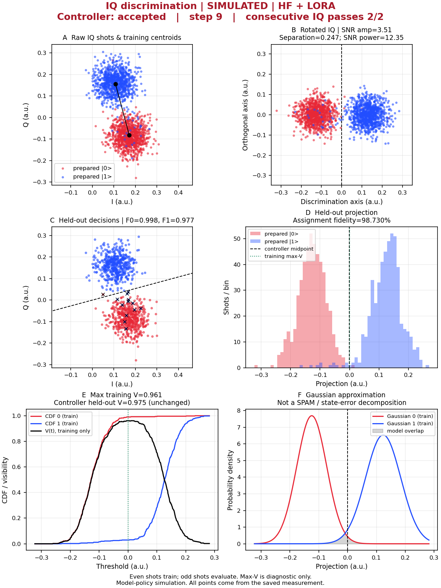

# Quantum Calibration Agent

English, simulation-first single-qubit calibration CLI. The model selects the next action;
registered numerical tools acquire/analyze data, and a strict controller enforces bounds,
prerequisites, budgets and independent IQ acceptance. No instrument adapter is enabled.

## Quick start

```bash
python -m pip install -e '.[terminal,report]'
qm-agent shell
```

The workspace launcher `./qm-agent` uses `runs/terminal/`. If a remote connection is configured,
it opens the SSH client; `./qm-agent shell` explicitly opens a local session. Existing source-version
checks protect old runs: start a new session after an upgrade, do not edit old checkpoints.

```text
/help       Show grouped commands
/plan       Preview the next action without measuring
/step       Confirm and execute one action
/run        Confirm and run within the remaining budget
/status     Inspect controller evidence
/report     Export actual IQ data as PNG, SVG, PDF and JSON
/quit       Save and exit
```

Rule mode is an observable-only baseline, not a language model. Configure HF with an existing local
Nanbeige checkpoint to enable general conversation and native function-call decisions. Training and
online inference share `calibration.step` and the checkpoint's JSON tool-call template. The atomic
tool runs acquisition followed by its registered analysis; the model cannot execute Python or shell.

## Reproducible batch run

```bash
qm-agent run --policy rule --backend physical --seed 2026090456 --output-dir runs/new-demo
qm-agent run --policy hf --model /absolute/path/to/Nanbeige4.2-3B --output-dir runs/new-model-run
```

Use `--prompt-profile minimal` only for the preregistered B0/F0 prompt ablation. The default
`skill` profile is the deployed B1/F1 calibration instruction. Both arms use the same model,
native tool schema, public context, controller and simulator; the run configuration records the arm.

Use a new output directory each time. Exit code zero means the evaluation executed without a
software/contract error; inspect `summary.json` for scientific success or escalation. Add
`--adapter /absolute/path/to/final_adapter` only for an adapter verified against the active protocol.
The v3-compatible adapter is published in the training repository's
[v0.2.0 release](https://github.com/neonccx/nanbeige-calibration-sft/releases/tag/v0.2.0).

## Scientific implementation

| Stage | Observation / deterministic analysis |
| --- | --- |
| S21 | Complex resonator notch, gain, phase, cable delay and mismatch; bounded complex fit |
| S21 ZPA2D | Frequency × normalized-ZPA complex S21 grid; measured ridge and periodic sweet-spot fit |
| Spectroscopy | Driven Bloch steady-state response; fitted transition and ambiguity detection |
| PiAmp | Detuned finite-pulse Rabi response; amplitude fit and repeat verification |
| Ramsey | Signed complex coherence; frequency correction and uncertainty |
| T1 / Echo | Shared relaxation/dephasing parameters; decay fits and coverage checks |
| XEB | Synthetic single-qubit randomized-circuit fidelity decay and per-cycle threshold |
| IQraw | Integrated dispersive response, preparation mixture, T1 jumps and receiver noise |

`physical` is a reduced two-level RWA/Markov/linear-cavity model, not a full device simulator.
`legacy` preserves the older analytic backend for explicit comparisons. Qiskit Metal is an optional
design/EM parameter source, not an IQ measurement backend. QuTiP validates selected reduced dynamics.

`sq.xeb` is explicitly a **synthetic single-qubit XEB-style proxy**. It is not Google's multiqubit
random-circuit-sampling benchmark and not a two-qubit/coupler calibration. Standard Clifford randomized
benchmarking is generally the more conventional single-qubit gate benchmark; this proxy is included to
exercise an XEB-shaped acceptance stage requested for the simulated workflow.

IQ centroids/classifier are fitted on even-indexed shots within each prepared label. Odd shots
evaluate F0/F1, visibility and assignment fidelity. Two independent passing batches at unchanged
settings are required. The maximum-visibility threshold is diagnostic only. Wilson intervals are
reported, but do not silently change the acceptance gate. Gaussian overlap is not SPAM-corrected fidelity.

## Recorded v3 model-policy simulation acceptance

The v3 LoRA policy accepted 2/3 fresh-seed simulation episodes; the unmodified base model accepted
0/3 on the same seeds. The two successful SFT episodes used 13 and 12 experiments and both ended with
two independent held-out IQ passes. This final six-panel report was regenerated from the saved step-13
measurement of episode 0 and required to reproduce the controller's recorded gate before export.



For this episode: F0 = 0.9824, F1 = 0.9785, visibility = 0.9609, assignment fidelity = 0.9805 and
SNR amplitude = 3.11. See [`iq_metrics.json`](docs/assets/evaluation_v3_20260909/iq_metrics.json) and
the training repository's [machine-readable v3 evidence](https://github.com/neonccx/nanbeige-calibration-sft/blob/main/evaluation/public_evidence_v3_20260909.json).

These are simulation results, not hardware validation. One of three SFT episodes ended in a policy
error, so the result is reported as 2/3 rather than filtered to successful runs.

## Preserved v2 simulation acceptance

The verified fit-update policy accepted all three fresh-seed simulation episodes in nine experiments
each. The figure below was regenerated from the saved final IQ acquisition for one episode; its
recomputed gate was required to match the original controller result before export. It is simulation
evidence, not a hardware measurement.



For this episode: F0 = 0.9980, F1 = 0.9766, visibility = 0.9746, assignment fidelity = 0.9873 and
SNR amplitude = 3.51. The exact machine-readable values and confidence intervals are preserved in
[`iq_metrics.json`](docs/assets/evaluation_20260905/iq_metrics.json).

## Data and verification

- [Training project](https://github.com/neonccx/nanbeige-calibration-sft): v2 data, frozen baselines and LoRA training.
- [v3 physics and protocol](docs/PHYSICS_V3.md): flux-tunable transmon, ZPA2D and XEB-style assumptions.
- [v3 implementation evidence](docs/V3_EVIDENCE.md): tests, dataset audit, model metrics and closed-loop result.
- [Research basis](docs/research.md): formulas, validation boundary and QMClaw adoption decisions.
- [Fit-update protocol](docs/FIT_UPDATE_PROTOCOL.md): deterministic fit arithmetic and model/tool boundary.
- [Simulation evidence](docs/SIMULATION_EVIDENCE.md): fresh-seed closed-loop results and IQ figure provenance.
- [QCalEval protocol](docs/QCALEVAL_PROTOCOL.md): pinned visual benchmark snapshots and honest partial scoring.
- [Prompt ablation](docs/PROMPT_ABLATION.md): controlled B0/B1/F0/F1 instruction comparison.
- [Historical README](docs/archive/README_before_v04.md): preserved deployment history, not current behavior.

```bash
python -m unittest discover -s tests -q
python scripts/validate_dynamics.py --output runs/new-validation/dynamics.json
python scripts/build_dataset_v2.py --devices 64 --output /absolute/new-dataset-directory
python scripts/audit_dataset_v2.py --dataset /absolute/dataset --model /absolute/model --output runs/new-audit.json
python scripts/build_dataset_v3.py --devices 32 --output /absolute/new-dataset-v3
python scripts/audit_dataset_v3.py /absolute/new-dataset-v3
```

Install `.[validation]` for the QuTiP check. Keep `evaluator_only/` out of training inputs. Raw artifacts
are content-addressed and never pasted into model prompts; exact structured fit outputs remain visible.

## Terminal design

STUDIO 03 keeps a compact borderless layout, streaming Markdown, plain text fallback and explicit
execution confirmations. Use `/theme mono`, `NO_COLOR=1`, `QM_AGENT_ASCII=1`, or `QM_AGENT_PLAIN=1`
for monochrome, ASCII or non-interactive output. Interface messages and model replies are English;
multilingual inputs remain supported. Passwords and API keys do not belong in Agent chat.
